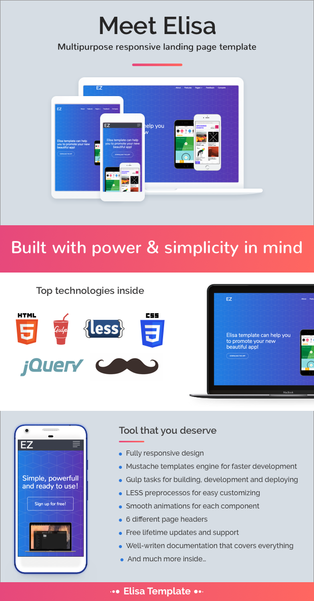

# Elisa - Multipurpose Landing Template

[Elisa](https://insiderdev.github.io/elisa-template-demo/) is a multipurpose landing page template built on Bootstrap 3.3.7. This responsive template comes with 8 Demo variations which can be used to build your product, service, marketing, app and SaaS landing pages.



You can find full documentation in [this repo](https://github.com/insiderdev/elisa-template-docs).

## Preview

Demo for this template's variants is available [here](https://insiderdev.github.io/elisa-template-demo/)

## Status

[](https://raw.githubusercontent.com/insiderdev/elisa-template/master/LICENSE)
[](https://david-dm.org/insiderdev/elisa-template)
[](https://david-dm.org/insiderdev/elisa-template?type=dev)

# Usage

## Required knowledge

You may learn some basic things at [w3school](http://www.w3schools.com/) and [MDN](https://developer.mozilla.org/).

We're using the following tools to provide you with the best file scructure and an amazing development experience:

- [Mustache](http://mustache.github.io/) as a template engine. Usually we're using it for including components inside the main page. It allows us to build pages easily.
- [Gulp](http://gulpjs.com/) as a tasks runner.
- [Less](http://lesscss.org/) as css pre-processor.

## Download

To begin using this template, choose one of the following options to get started:
* Clone the repo: `git clone https://github.com/insiderdev/elisa-template`
* [Fork, Clone, or Download on GitHub](https://github.com/insiderdev/elisa-template)

## Getting started

If you already downloaded theme open your project folder and run `npm install` to install project's libraries.

Open your command line and run `gulp` and then `gulp dev`. This command will build the template and open it inside the browser (if not, please open [http://localhost:3000](http://localhost:3000) inside browser).

## Building project for production

When you finished with your project just run `gulp` and your built template will be placed inside `dist` folder. You can upload this folder directly to your hosting via FTP.

## Project file structure
```bash
Elisa template/
|-- components/
|   |-- common/
|   |-- headers/
|   |-- sections/
|-- Docs/
|-- img/
|-- js/
|-- less/
    |-- components/
    |   |-- sections/
    |   |-- ...
    |-- mixins.less
    |-- style.less
    |-- variable.less
```

## Creating Landing Page

To create a new landing page you have to edit `index.mustache` file inside root folder and fill it with components (all components are described below).

To add a new component to your page:

1. Choose component from our library.
2. Insert it to the `index.mustache` page using the following syntax: `{{> components/sections/[component-name] }}`

Yes, this is so easy.

## Gulp Tasks

- `gulp` the default task that builds everything
- `gulp dev` browserSync opens the project in your default browser and live reloads when changes are made
- `gulp sass` compiles SCSS files into CSS
- `gulp minify-css` minifies the compiled CSS file
- `gulp minify-js` minifies the themes JS file
- `gulp copy` copies dependencies from node_modules to the vendor directory

# Documentation

Full documentation is available [here](https://github.com/insiderdev/elisa-template-docs)
